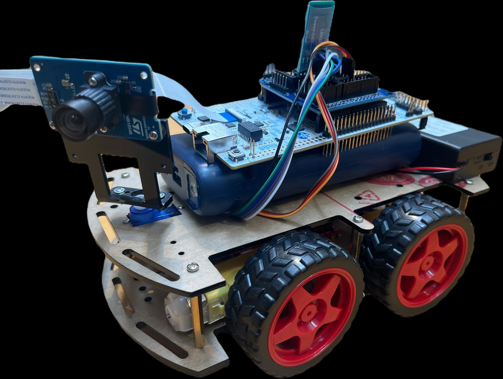

# Embedded Vision for Gesture-Controlled RC-Car Steering and Active Ball Tracking

Machine learning running entirely **on microcontrollers** (no PC in the loop), built
around a small RC car driven by two STM32 boards:

- A **hand-gesture classifier** on an STM32U5 watches a camera and turns gestures
  (palm, fist, …) into drive commands, sent to the car over Bluetooth.
- A **ball detector** on an STM32N6 runs a YOLO-style network on the on-chip NPU,
  finds a ball in the camera feed, and pans/chases it autonomously.

All inference happens on-device — the models are trained on a PC, quantized, and
deployed to the boards; the host only watches the live output.

<p align="center">
  <a href="https://youtu.be/WXF68EdYNcE">
    
  </a>
  <br><em>The assembled gesture-controlled, ball-chasing RC car — click to watch the demo.</em>
</p>

> 📄 For a full walkthrough of the project, see the **[project presentation (PDF)](presentation/Paul_Presentation_v2.pdf)**.

## Table of Contents

- [Overview](#overview)
- [How it works](#how-it-works)
- [Repository structure](#repository-structure)
- [Getting started](#getting-started)
- [Hardware](#hardware)
- [License](#license)

## Overview

The project demonstrates a full **edge-ML pipeline** — from dataset to trained model
to a quantized network running on a Cortex-M / NPU microcontroller — applied to two
real-time vision tasks on a single robot platform. Each stage lives in its own
folder, each with its own README:

| Folder | What's in it |
| :----- | :----------- |
| [`datasets/`](datasets/README.md) | The datasets used for training (ball detection + hand gestures) and how they're organized. |
| [`software/`](software/README.md) | PC-side training/eval/export pipelines (PyTorch → ONNX → INT8) for both models, plus shared utilities and tools. |
| [`firmware/`](firmware/README.md) | The on-device applications: `BallDetector_N6` (STM32N6) and `Classifier_U5` (STM32U5), plus host viewer scripts. |
| [`hardware/`](hardware/README.md) | The physical build — boards, cameras, the RC car, Bluetooth link and power. |
| [`presentation/`](presentation/) | Slides, figures and demo material — see the [project presentation (PDF)](presentation/Paul_Presentation_v2.pdf). |

## How it works

```text
  Gesture control (STM32U5)                 Ball tracking (STM32N6)
  ─────────────────────────                 ───────────────────────
  camera → gesture model → command          camera → ball detector → box
                │                                          │
            HC-05 (BT)                              servo pan + motors
                │                                          │
            HC-06 on car ───────────────────────────►  RC car
```

- **Gesture path:** the U5 classifies a hand gesture each frame and sends one drive
  command (forward / left / right / back / stop) to the car over a Bluetooth serial
  link (HC-05 → HC-06).
- **Ball path:** the N6 detects the ball on its NPU, pans the camera servo to keep
  it centered, and drives the motors to follow it. It also streams the annotated
  video to a PC as a standard USB webcam.

See [`firmware/`](firmware/README.md) for the on-device apps and
[`software/`](software/README.md) for how the models are trained and exported.

## Getting started

1. **Train / export a model** — set up the Python environment and pipelines in
   [`software/`](software/README.md).
2. **Build & flash the firmware** — deploy the model to a board following
   [`firmware/`](firmware/README.md) (`BallDetector_N6` or `Classifier_U5`).
3. **Assemble the hardware** — wire up the car, boards, camera and power as
   described in [`hardware/`](hardware/README.md).

## Hardware

Two STM32 boards (NUCLEO-N657X0-Q and B-U585I-IOT02A), their cameras, an HC-05/HC-06
Bluetooth pair, and an L298N + servo RC car powered from a 2S LiPo. Full component
list and wiring: [`hardware/README.md`](hardware/README.md).

## License

See individual subfolders for third-party licenses (ST firmware components retain
their original ST licensing).
